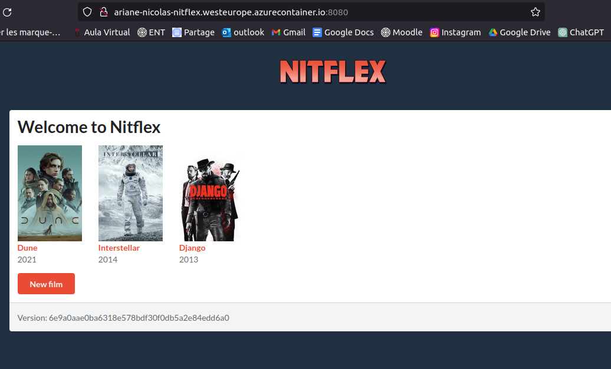

## Nombre del alumno: 
**Ariane NICOLAS**

## Repo Github 

URL : **https://github.com/ArianeNicolas/ais-a.nicolas.2023-2024-ghf.git**

## Applicacion desplegada

URL : **ariane-nicolas-nitflex.westeurope.azurecontainer.io**

# Practica 5

git checkout -b develop : crea la rama develop y nos situa dentro

git push --set-upstream origin develop

git status : Para verificar que estoy bién en la rama develop

git checkout -b feature1 : crea la rama feature1 y nos situa dentro

git push --set-upstream origin feature1

git add .
git commit -m "new functionality : "
git push

**nueva funcionalidad**

git checkout -b issues

**resolucion del problema**

git add .
git commit -m "bug fixed, cancel button of editing a film working"
git push

